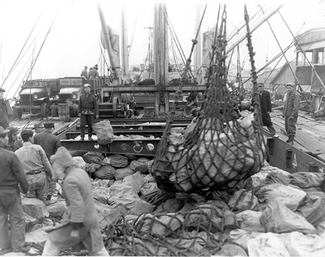
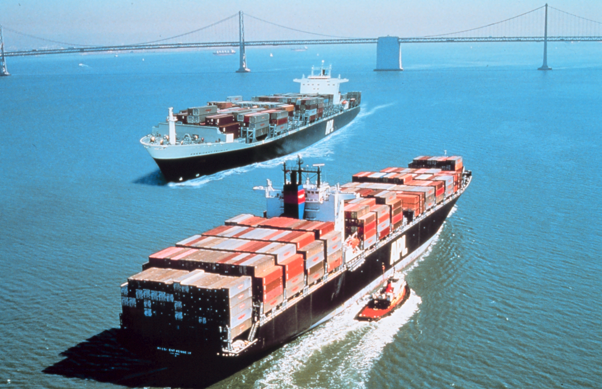
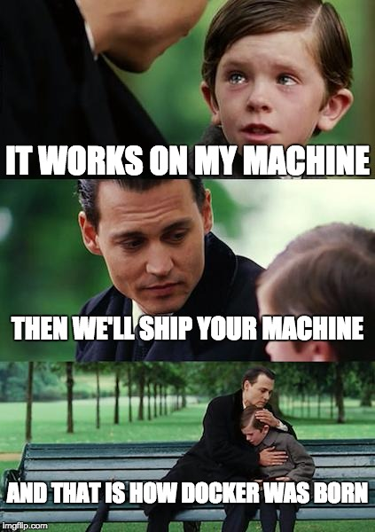

# Docker

----

## Transporte de mercancías en barcos

### ¿Cómo podemos hacerlo?

----

#### Opción 1



<https://en.wikipedia.org/wiki/File:Korean-war-merchant-marine-load.jpg>

----

#### Opción 2



<https://en.wikipedia.org/wiki/File:Container_ships_President_Truman_(IMO_8616283)_and_President_Kennedy_(IMO_8616295)_at_San_Francisco.jpg>

----

## ¿Qué es Docker?

Es una plataforma que permite gestionar contenedores.

----

### ¿Qué es un contenedor?

Un paquete ejecutable, ligero y auto-contenido con todo lo necesario para ejecutar una pieza de software: código, librerias del sistema, etc.

----

### Diferencias entre máquinas virtuales y contenedores

* Una máquina virtual contiene todo lo que un sistema operativo necesita para
   funcionar.
   Un contenedor contiene lo mínimo para hacer funcionar cierto software.
* Una máquina virtual tiene su propio kernel.
   Un contenedor lo comparte con su host.

----

### Ejercicio 1: Lanzar un Docker

```bash
docker run debian:stretch-slim
```

----

## ¿Por qué nos puede interesar Docker?

----

### Ventajas de utilizar Docker

* Evitar mantenimiento excesivo y preocupaciones con dependencias.
* Control de versiones para contenedores.
* Despliegue rápido.
* Mayor seguridad por aislamiento de programas.

----



----

## Ejemplo 1: Container of Hell

```bash
docker run --rm -it --name debian_stretch debian:stretch-slim
```

Mejor no probéis lo siguiente. Dentro del contenedor:

```bash
xrm -rf / --no-preserve-root
```

*Nota: el comando `rm` está mal escrito para evitar desastres*

----

## Comandos básicos

* Buscar una imagen: `docker pull [nombre]`
* Descargar una imagen: `docker pull [nombre]`
* Lanzar un contenedor: `docker run [nombre]`
* Parar un contenedor: `docker stop [nombre]`
* Ver contenedores existentes: `docker ps`
* Ver imágenes de docker descargadas: `docker images`


---

## Aprender a desarrollar aplicaciones con Docker

Si te interesa Docker te recomendamos hacer el curso de Katacoda de Docker

[Link del curso de Katacoda de Docker](https://www.katacoda.com/courses/docker)